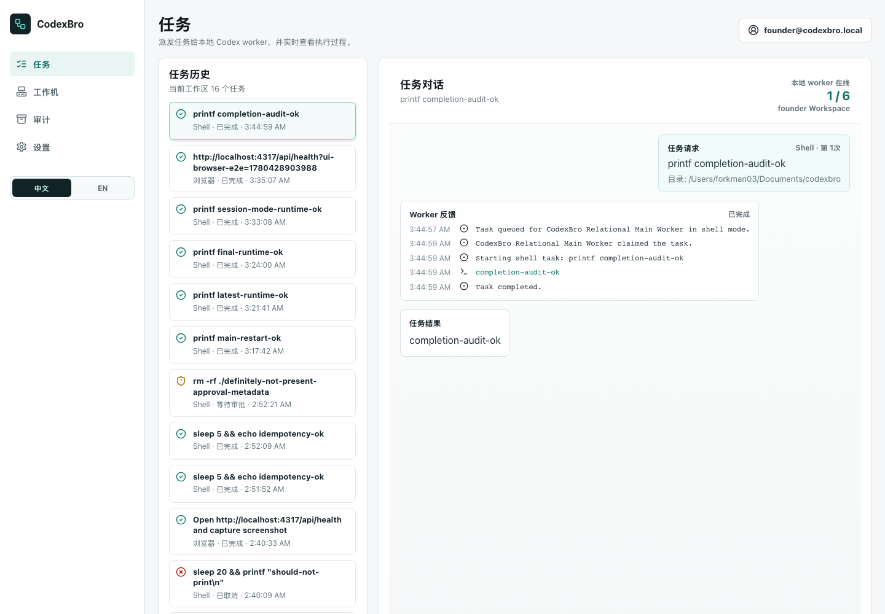
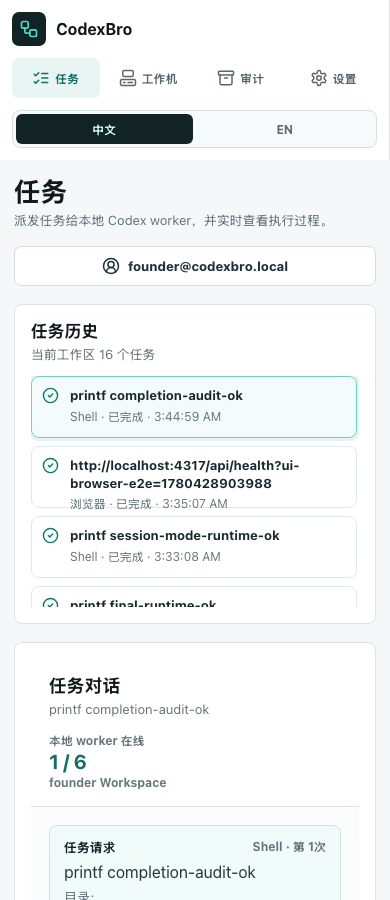

# CodexBro

[中文说明](README.zh-CN.md)

Run Codex-style work from a web console while keeping execution on your own machine.

CodexBro is an experimental local-execution control plane for Codex-style agents. The web console lets a user log in, bind a local worker, upload workspace-scoped files, then work from a task conversation: task history on the left, live worker feedback in the chat, and a composer for new local tasks at the bottom. The console defaults to Chinese and includes a Chinese/English language switch.

[](https://github.com/cxhihilwb123-hash/codexbro/actions/workflows/ci.yml)

> CodexBro is an unofficial open-source project. It is not affiliated with, endorsed by, or sponsored by OpenAI. Codex, ChatGPT, and OpenAI are trademarks of their respective owners.



## Why This Exists

Many teams want a web UI for dispatching agent work while keeping execution on a trusted local machine. CodexBro is a runnable reference implementation for that pattern: a server-side control plane, a local worker, approval gates, audit logs, workspace files, artifacts, and experimental native Browser/Computer handoff paths.

The project is early-stage OSS. The stable core is local task orchestration, worker lifecycle, file/task management, and auditable shell/Codex execution. Native browser and desktop control are experimental and depend on local Codex/Codex Desktop/CuaDriver readiness.

## Features

- Web console for task conversations, task history, worker status, files, audits, settings, and admin provisioning.
- Local worker CLI with one-time pairing tokens, persisted worker tokens, allowlisted directories, task-mode allowlists, cancellation, retry, and stale recovery.
- SQLite-backed server with workspaces, users, sessions, tasks, logs, workers, artifacts, prompt templates, and audits.
- Approval prompts for risky local execution.
- Workspace file uploads and task-scoped file downloads for workers.
- Chinese-first UI with English switching.
- Automated E2E and UI smoke tests for local and CI use.
- Experimental Codex Browser/Computer delegation through app-server, exec, and Desktop bridge paths.

## Screenshots

The included screenshots are generated from non-sensitive local smoke data. See `docs/SCREENSHOTS.md` for the screenshot index and privacy checklist.



The task conversation highlights live execution state with a stage strip, feedback counters, the latest worker message, and a progress timeline. Worker cards include a capability matrix for Shell, Codex, Browser, and Computer modes, and the task composer shows whether the selected local worker can accept the current mode before dispatch. Approval prompts explain the exact paused action and make Browser/Computer confirmations explicit before local Codex continues.

Each task runs in an isolated local workspace under `.codexbro/task-workspaces/<taskId>/attempt-<n>/`. Workspace files attached from the server are copied into `input/`, temporary work belongs in `scratch/`, and files saved to `output/` are collected after completion, uploaded to the server as task artifacts, and shown in the conversation and Artifacts panel. Image artifacts render as previews and remain downloadable.

## Run the MVP

```bash
npm install
npm run dev
```

Open `http://localhost:5173`, log in as the bootstrapped platform admin, create a customer account from the Admin view, then log in as that customer and create a pairing token for the customer's workspace. The local development admin defaults to `founder@codexbro.local` / `codexbro-demo`; set `CODEXBRO_ADMIN_EMAIL` and `CODEXBRO_ADMIN_PASSWORD` to change it.

```bash
npm run worker -- \
  --server http://localhost:4317 \
  --pairing-token <token> \
  --token-file .codexbro/worker-token.json \
  --allowed-dir /path/to/project
```

The web console also shows a recommended Desktop launch command for local Browser/Computer tasks. It includes `CODEXBRO_NATIVE_TASK_BACKEND=desktop`, `CODEXBRO_DESKTOP_ALLOW_FOREGROUND=true`, and `CODEXBRO_DESKTOP_BRIDGE_SMOKE_READINESS=true` so the worker can prove the Codex Desktop chatbox bridge before browser/computer jobs depend on it.

Pairing tokens are one-time, 30-minute bootstrap credentials. After the first successful registration, the worker saves its long-lived worker token to `.codexbro/worker-token.json` by default, so the same local connector can restart without a new pairing token. The Workers page can unbind a machine, which revokes that saved worker token on the server and fails any unfinished tasks assigned to that local connector.

Run `npm run doctor:desktop` before starting a Desktop worker to check Codex CLI, Codex Desktop bridge diagnostics, CuaDriver permissions, Chrome readiness, and whether the recommended Desktop environment flags are set. Add `-- --json` for machine-readable output, or `CODEXBRO_DESKTOP_ALLOW_FOREGROUND=true npm run doctor:desktop -- --smoke` for the real foreground marker-file smoke test.

The MVP supports `Shell`, `Codex`, `Codex Browser plugin`, and `Codex Computer Use` tasks. Shell and Codex tasks are constrained to the local connector's `--allowed-dir` allowlist. Browser and computer-use tasks can run through the experimental `codex app-server` backend, which lets the worker start local Codex threads/turns over JSON-RPC, preflight native skills such as `browser:control-in-app-browser`, `chrome:control-chrome`, and `cua-driver`, then attach those relevant skills as explicit `turn/start` input blocks. A listed skill does not guarantee that its runtime backend is attached, so browser tasks also perform a short Browser Use runtime probe through app-server before starting the model turn, and computer tasks check the local CuaDriver CLI, TCC permissions, daemon status, and app enumeration. Native unavailability markers such as `BROWSER_PLUGIN_UNAVAILABLE` and `COMPUTER_USE_UNAVAILABLE` are surfaced as task failures. The older `codex exec` and Codex Desktop bridge paths remain available as configured fallbacks. The connector does not implement a separate Playwright browser controller. Shell commands and Codex app-server approval requests that need user confirmation pause in the web console before they can continue.

Useful worker options:

- `--allowed-dir /path/to/project`: allow shell and Codex work inside this directory.
- `--allowed-mode shell|codex|browser|computer`: restrict which task modes the local connector will accept. Pass the flag more than once to allow multiple modes.
- `--token-file .codexbro/worker-token.json`: where the local connector saves and later reloads its server-issued worker token. `CODEXBRO_WORKER_TOKEN_FILE` can set the same path through the environment.
- `CODEXBRO_CODEX_BIN`: optional command path for the Codex CLI. Defaults to `codex`.
- `CODEXBRO_NATIVE_TASK_BACKEND=app-server|desktop|exec`: choose how `browser` and `computer` tasks are delegated. Defaults to `desktop` unless `CODEXBRO_CODEX_BIN` is set, in which case it defaults to `exec`.
- `CODEXBRO_APP_SERVER_CODEX_BIN`: optional command path for `codex app-server`. Defaults to `CODEXBRO_CODEX_BIN` or `codex`.
- `CODEXBRO_APP_SERVER_APPROVAL_POLICY`, `CODEXBRO_APP_SERVER_SANDBOX`, `CODEXBRO_APP_SERVER_MODEL`, `CODEXBRO_APP_SERVER_EFFORT`: optional values passed through to app-server threads/turns.
- `CODEXBRO_APP_SERVER_MEMORIES=false`: pass `-c features.memories=false` when starting `codex app-server`.
- `CODEXBRO_APP_SERVER_CONFIG`: semicolon-separated extra `-c key=value` config overrides for `codex app-server`.
- `CODEXBRO_APP_SERVER_ENABLE_FEATURES` / `CODEXBRO_APP_SERVER_DISABLE_FEATURES`: comma-separated feature names passed as repeated `--enable` or `--disable` flags.
- `CODEXBRO_APP_SERVER_BROWSER_RUNTIME_PROBE=false`: skip the app-server Browser Use runtime probe. By default browser tasks check whether app-server can actually see a controllable browser backend, not only whether the browser skills are installed.
- `CODEXBRO_APP_SERVER_REQUIRE_BROWSER_RUNTIME=false`: continue into a browser model turn even when the runtime probe explicitly finds no controllable browser backend. By default that condition fails early or uses the configured app-server fallback.
- `CODEXBRO_APP_SERVER_BROWSER_RUNTIME_PROBE_TIMEOUT_MS`: timeout for the Browser Use runtime probe. Defaults to `12000`.
- `CODEXBRO_APP_SERVER_REQUIRE_CUA_DRIVER=false`: continue into a computer model turn even when the local CuaDriver preflight fails. By default computer tasks require CuaDriver to be installed, permissioned, and able to enumerate apps.
- `CODEXBRO_APP_SERVER_FALLBACK=desktop|exec`: when app-server exposes skills but cannot access the native browser/computer runtime, retry through the Codex Desktop bridge or the older `codex exec` path. Omit this to keep app-server failures visible.
- `CODEXBRO_APP_SERVER_REUSE=false`: disable app-server process reuse. By default the worker reuses an idle app-server for the same command/config/cwd.
- `CODEXBRO_APP_SERVER_IDLE_MS`: how long an idle reusable app-server stays alive. Defaults to `300000`.

### Common worker startup examples

Single repository with one allowed directory:

```bash
npm run worker -- \
  --server http://localhost:4317 \
  --pairing-token <token> \
  --token-file .codexbro/worker-token.json \
  --allowed-dir /Users/alice/src/codexbro
```

Shell-only worker for a narrow local project:

```bash
npm run worker -- \
  --server http://localhost:4317 \
  --pairing-token <token> \
  --token-file .codexbro/worker-token.json \
  --allowed-dir /Users/alice/src/ops-notes \
  --allowed-mode shell
```

Codex-only worker for one workspace tree:

```bash
npm run worker -- \
  --server http://localhost:4317 \
  --pairing-token <token> \
  --token-file .codexbro/worker-token.json \
  --allowed-dir /Users/alice/src/customer-a \
  --allowed-mode codex
```

Desktop worker for Shell, Codex, Browser, and Computer tasks:

```bash
CODEXBRO_NATIVE_TASK_BACKEND=desktop \
CODEXBRO_DESKTOP_ALLOW_FOREGROUND=true \
CODEXBRO_DESKTOP_BRIDGE_SMOKE_READINESS=true \
npm run worker -- \
  --server http://localhost:4317 \
  --pairing-token <token> \
  --token-file .codexbro/worker-token.json \
  --allowed-dir /Users/alice/src/codexbro \
  --allowed-mode shell \
  --allowed-mode codex \
  --allowed-mode browser \
  --allowed-mode computer
```

Desktop warning: Browser and Computer tasks are experimental, foreground Codex Desktop during dispatch, and should only be enabled on a machine where the user expects that visible handoff.

Tasks can be canceled from the web console. Pending and approval-waiting tasks cancel immediately; running shell/Codex/browser/computer tasks are interrupted through the local connector. If a connector disconnects while a task is running, the server requeues stale running tasks after the configured heartbeat timeout, delays the next attempt with exponential backoff, and fails the task after the stale retry limit is reached.

Workers report native readiness during registration and heartbeat. The Workers page shows the selected native backend plus checks for Codex CLI, `codex app-server`, the Codex Desktop bridge script, CuaDriver, and Chrome extension/native-host readiness. Desktop Bridge reports `available` when the script is installed on macOS; set `CODEXBRO_DESKTOP_BRIDGE_DIAGNOSE_READINESS=true` to additionally verify that CuaDriver can snapshot a Codex window and upgrade the check to `ready`. Neither path is an end-to-end task submission smoke test. These checks are diagnostic: a worker can still connect when a native channel is not ready, but browser/computer tasks will fail early or use the configured fallback when their required runtime is unavailable.

Set `CODEXBRO_DESKTOP_BRIDGE_SMOKE_READINESS=true` together with `CODEXBRO_DESKTOP_ALLOW_FOREGROUND=true` to add a real Desktop Smoke readiness check. That smoke briefly foregrounds Codex Desktop, submits a tiny marker-file task through the chatbox bridge, and reports `ready` only when Codex writes the expected result marker. Optional timing controls are `CODEXBRO_DESKTOP_BRIDGE_SMOKE_TIMEOUT_MS` and `CODEXBRO_DESKTOP_BRIDGE_SMOKE_POLL_MS`.

Native control status as of this implementation:

- Worker-launched `codex app-server` can start Codex threads and list native skills, but the Browser Use runtime probe currently shows no controllable browser backend from that raw process when it is not attached to Codex Desktop's Electron runtime.
- Codex Desktop contains a real app-server bridge behind Electron IPC, but the desktop app does not expose a local TCP/DevTools endpoint by default, so CodexBro cannot inject requests into that in-process bridge externally.
- Codex Desktop supports `codex://threads/<conversationId>` links for existing threads. A new-thread URL carrying `path` and `prompt` was not found in the desktop bundle, so the Desktop bridge uses CuaDriver to launch Codex, open a project composer, and fill the prompt instead of relying on a nonexistent deep link.
- The Desktop bridge has an end-to-end foreground-dispatch smoke path: when `CODEXBRO_DESKTOP_ALLOW_FOREGROUND=true`, it briefly foregrounds Codex, clears the composer, pastes the prompt, submits with a foreground Return key event, then monitors the result marker/file.
- `CODEXBRO_DESKTOP_ALLOW_FOREGROUND=true`: allow the Desktop bridge to briefly foreground Codex before typing/submitting. This is the practical path for a local Codex task dispatcher because the tested Codex Desktop composer does not reliably accept background text input.
- `CODEXBRO_DESKTOP_FOREGROUND_PASTE=false`: disable clipboard paste in foreground-dispatch mode and fall back to CuaDriver text typing. Foreground paste is enabled by default only when `CODEXBRO_DESKTOP_ALLOW_FOREGROUND=true`.

See `docs/NATIVE_CONTROL_STATUS.md` for the current native-control decision record.

To reproduce the raw app-server browser-runtime check locally:

```bash
npm run probe:native-browser -- /path/to/project
```

Task creation accepts an optional `idempotencyKey`; if an active task already has that key, the server returns the existing task with `deduped: true`. Finished tasks can be retried from the web console or `POST /api/tasks/:taskId/retry`, which creates a new attempt linked with `parentTaskId`.

Approval prompts include structured metadata so the UI can show the risk class, action, command, and working directory before the user approves.

Every provisioned user gets at least one workspace. Workspace roles are `owner`, `admin`, `operator`, and `viewer`; owners, admins, and operators can create pairing tokens and tasks, while viewers can inspect workspace activity. Workers belong to a workspace and tasks can only target workers in workspaces the signed-in user can access.

Platform account provisioning is admin-led by default. Unknown emails cannot self-register unless `CODEXBRO_ALLOW_SELF_SIGNUP=true` is set. Platform admins can create customer accounts, create the customer's initial workspace, reset passwords, and disable or re-enable accounts from the Admin view.

Workspace files can be managed from the Files view or uploaded from the task composer. The current file space is flat, like a simple drive folder: users can browse, search, upload, download, delete, and attach files to tasks. Files are stored under the user's workspace in `.codexbro/workspace-files`. The files remain on the server; workers and Codex receive task-scoped file metadata plus authenticated download URLs, then pull files from the server only when needed.

The task composer includes prompt templates for lightweight social/customer workflows: customer research, low-risk engagement, and content publishing. These templates do not add a separate automation engine. They fill the task prompt and recommended execution mode so local Codex can use its Browser/Computer capabilities while following human-confirmation boundaries for login, CAPTCHA, commenting, DMs, payment, and final publishing. Customers can also create, edit, delete, and reuse custom prompt templates stored in their server-side workspace.

Useful server settings:

- `PORT`: API server port. Defaults to `4317`.
- `HOST`: API bind host. Omit for the Node default, or use `0.0.0.0` for container/network access.
- `CODEXBRO_PUBLIC_SERVER_URL`: public API URL shown in generated worker pairing commands. Defaults to `http://localhost:<PORT>`.
- `CODEXBRO_CORS_ORIGIN`: comma-separated browser origins allowed to call the API. Omit for the default development CORS behavior.
- `CODEXBRO_ADMIN_EMAIL`: bootstrapped platform-admin email. Defaults to `founder@codexbro.local`.
- `CODEXBRO_ADMIN_PASSWORD`: password used only when the bootstrapped admin user is first created. Defaults to `codexbro-demo`.
- `CODEXBRO_BOOTSTRAP_ADMIN=false`: disable automatic platform-admin creation.
- `CODEXBRO_ALLOW_SELF_SIGNUP=true`: restore the original MVP behavior where unknown emails are created on first login. Omit this for admin-provisioned SaaS accounts.
- `CODEXBRO_STALE_WORKER_MS`: heartbeat age before a running task is considered stale. Defaults to `45000`.
- `CODEXBRO_STALE_MAX_ATTEMPTS`: maximum stale execution attempts before the task fails. Defaults to `3`.
- `CODEXBRO_STALE_RETRY_BACKOFF_MS`: base retry delay for stale requeues. Defaults to `5000`.
- `VITE_PORT`: dev server port for the web workspace. Defaults to `5173`.
- `VITE_PROXY_API_TARGET`: dev proxy target for `/api`. Defaults to `http://localhost:4317`.
- `VITE_CODEXBRO_API_URL`: web build-time API base URL when the frontend is served from a different origin.

See `.env.example` for a deployable starting point.

## Development

```bash
npm ci
npm run check
npm run build
npm run test:e2e
npm run test:ui
```

More setup notes live in `docs/LOCAL_SETUP.md`, `docs/ARCHITECTURE.md`, and `docs/DEPLOYMENT.md`.

## More Documentation

- `README.zh-CN.md`: Chinese project overview.
- `docs/DEMO.md`: five-step local demo walkthrough.
- `docs/FAQ.zh-CN.md`: Chinese FAQ for users and contributors.
- `docs/THREAT_MODEL.md`: local-execution security model and trust boundaries.
- `docs/COMPARISON.md`: how CodexBro differs from CI runners, remote desktop, and plain chat UIs.

## Verification

```bash
npm run check
npm run build
npm run test:e2e
npm run test:ui
npm run test:desktop-e2e
```

`npm run test:e2e` starts a temporary API server and real local connectors, then verifies admin-provisioned customer accounts, self-signup rejection, disabled-user login rejection, workspace creation, workspace file upload/list/download, workspace prompt template CRUD, task-scoped server file pull by workers, pairing, shell execution, approval pauses, idempotent task creation, manual retry, mode permissions, Codex Browser/Computer delegation through `codex exec`, stale retry/backoff behavior, audit events, and SQLite persistence.

`npm run test:ui` starts a temporary API server and Vite web server, seeds a customer and connector through the admin flow, then uses Playwright to verify Chinese default copy, English switching, platform Admin navigation for admins only, login, the Codex-style task conversation, clearer execution feedback, workspace Files browsing/search, built-in and custom prompt template fill behavior, selected-worker capability feedback, Codex Browser/Computer mode controls, Workers capability detection, Tasks/Files/Workers/Audit/Settings navigation, and mobile nav fit.

`npm run test:desktop-e2e` is an opt-in local macOS acceptance test. It starts a temporary API server and worker, foregrounds Codex Desktop through the Desktop bridge, verifies Desktop Smoke readiness, streams Desktop progress into task logs, then runs real Browser and Computer tasks through local Codex. See `docs/DESKTOP_BRIDGE_E2E.md`.

## Storage

The server uses SQLite by default and stores its database at `.codexbro/data.sqlite`. Set `CODEXBRO_DATA_DIR=/path/to/data` to move the database and artifacts. The server can still run the original JSON store with `CODEXBRO_STORAGE=json`, which writes `.codexbro/data.json`.

SQLite uses normalized tables for users, sessions, workspaces, workspace members, workspace files, workspace prompt templates, pairing tokens, worker tokens, workers, tasks, task logs, audits, and artifact file indexes. A `kv_store` compatibility snapshot is also kept so older MVP data can migrate forward cleanly.

## Workspace Layout

- `packages/web`: React/Vite SaaS console with a Codex-style task conversation.
- `packages/server`: local control-plane API, task queue, auth, worker registry, realtime events.
- `packages/worker`: local worker CLI that binds to a user account and executes tasks.
- `packages/shared`: shared protocol and domain types.

## Contributing

See `CONTRIBUTING.md`. Good first contributions are welcome in docs, diagnostics, tests, and UI clarity. Changes that expand local execution, browser control, desktop control, token handling, or artifact access should include explicit security notes and verification evidence.

## Security

See `SECURITY.md`. Do not commit `.codexbro/`, local databases, logs, worker tokens, extracted proprietary app bundles, or screenshots with real accounts/customer data.

## License

CodexBro is licensed under AGPL-3.0-or-later. See `LICENSE`.

Commercial licensing is available for organizations that want to use CodexBro in closed-source products or services without AGPL obligations. See `COMMERCIAL_LICENSE.md`.
